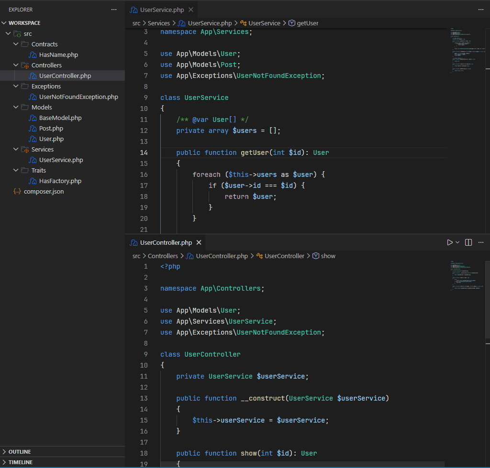
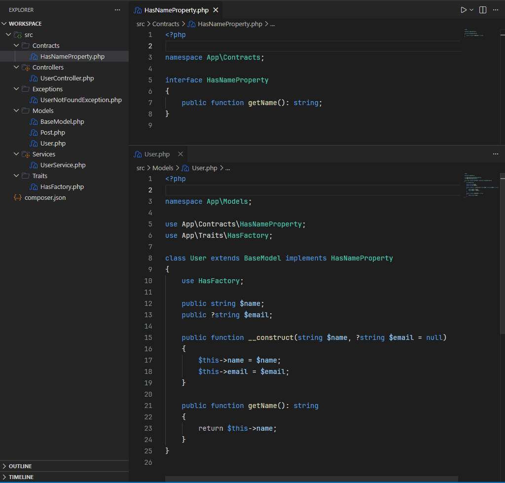
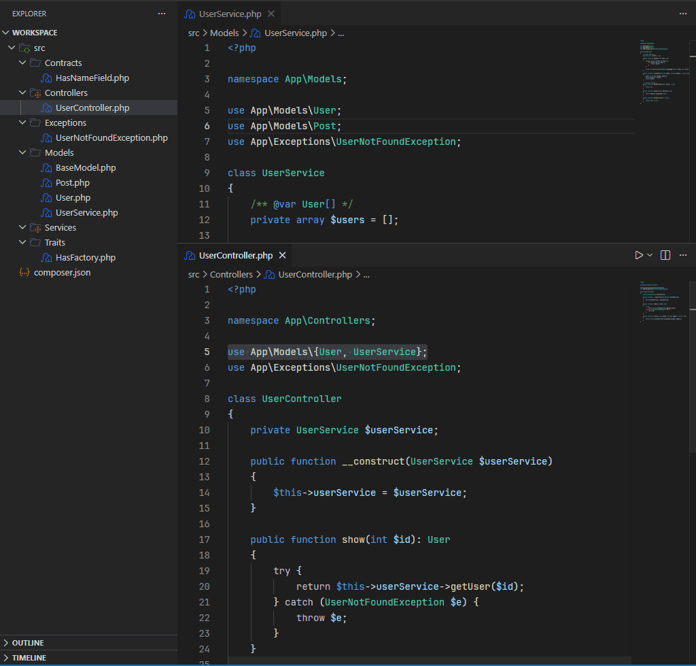
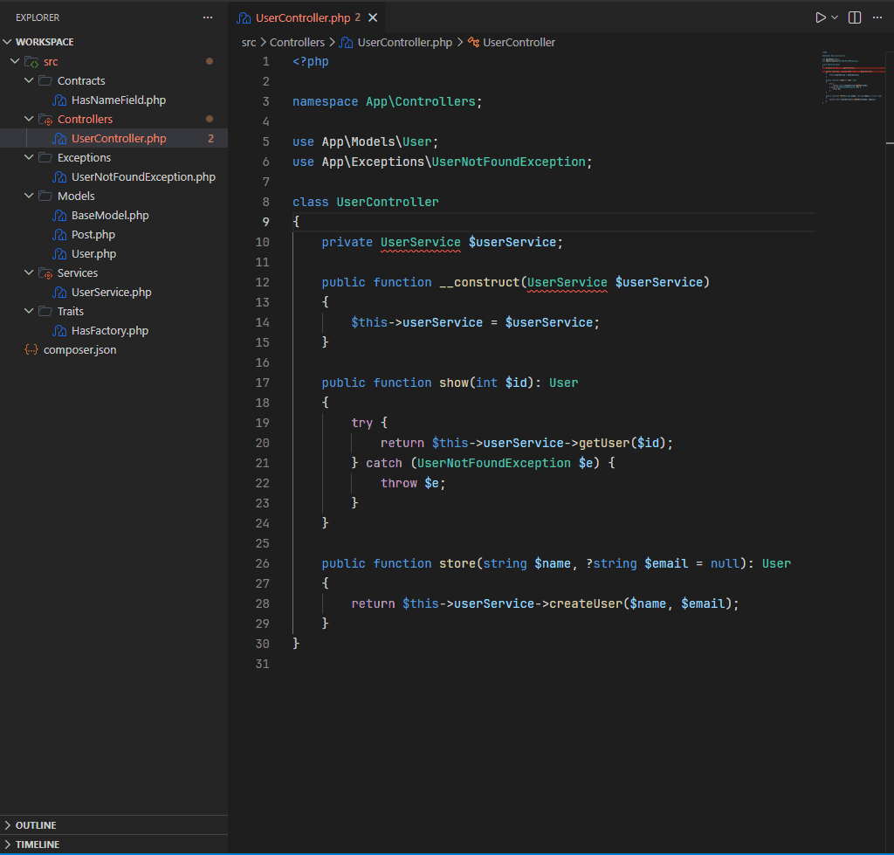

<h3 align="center">
 
PHP Better Refactors
</h3>

PSR-4-aware PHP refactoring for VS Code. Automatically updates class names, namespaces, and all references across your project when you rename or move files. Includes classes, interfaces, traits and enums.

## Features

- **Rename Symbol** for class names, methods, and properties with cross-project reference updates
- **File rename → Class rename** — renaming `User.php` to `Account.php` renames class `User` to class `Account` and updates all references
- **File move → Namespace update** — moving a file to a different folder updates the `namespace` declaration and cross-project reference updates
- **Import class** quick fix — suggests adding `use` statements for unresolved class references
- Updates all `use` statements, type hints, `new`, `extends`, `implements`, `::class`, `catch`, `instanceof`, attributes, and more
- Handles group use statements, aliased imports, and fully-qualified references
- PSR-4 namespace resolution from `composer.json`

## Demos

Rename Symbol

Right-click a class name, method, or property and select **Rename Symbol**. The declaration, file, and all references across the project are updated.

File Rename

Rename a `.php` file in the explorer — the class declaration and all references are updated automatically.

File Move

Move a file to a different folder — the namespace declaration and all references are updated.

Import Class

Use a class without a `use` statement and get a quick fix to import it.

## Installation

### Marketplace

Visit [the extension page](https://marketplace.visualstudio.com/items?itemName=kevinvargasl.php-better-refactors) and press **install**.

### From .vsix

- Download the .vsix file from the latest [release](https://github.com/kevinvargasl/php-better-refactors/releases)
- Open VS Code
- Press Ctrl+Shift+P and run **Extensions: Install from VSIX...**
- Select the .vsix file

## Settings

All settings are under `phpBetterRefactors.*` in VS Code settings.

| Setting | Type | Default | Description |
|---|---|---|---|
| `phpBetterRefactors.enableAutoRename` | `boolean` | `true` | Automatically rename class when file is renamed |
| `phpBetterRefactors.enableAutoNamespace` | `boolean` | `true` | Automatically update namespace when file is moved |
| `phpBetterRefactors.excludePatterns` | `string[]` | `["**/vendor/**", "**/node_modules/**"]` | Patterns for files/folders to exclude from reference scanning |

## Commands

| Command | Description |
|---|---|
| `PHP Better Refactors: Rebuild Index` | Re-scan all PHP files and rebuild the reference index |

## Requirements

- VS Code 1.85.0 or later
- A `composer.json` file in the workspace (for PSR-4 namespace resolution)
